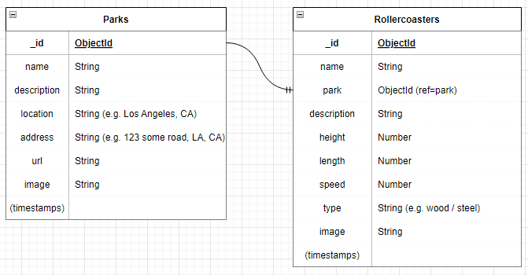
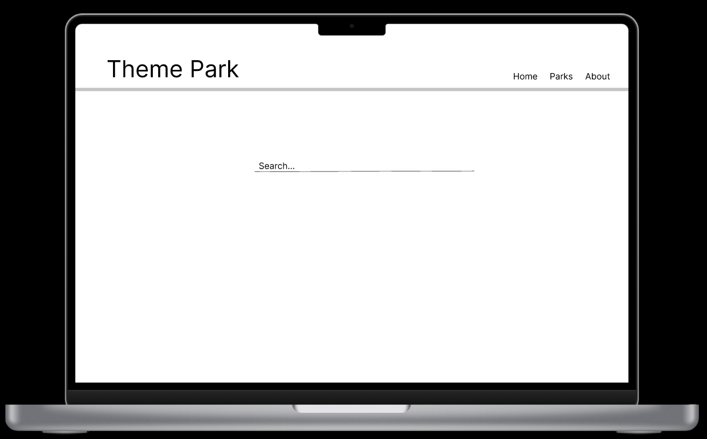
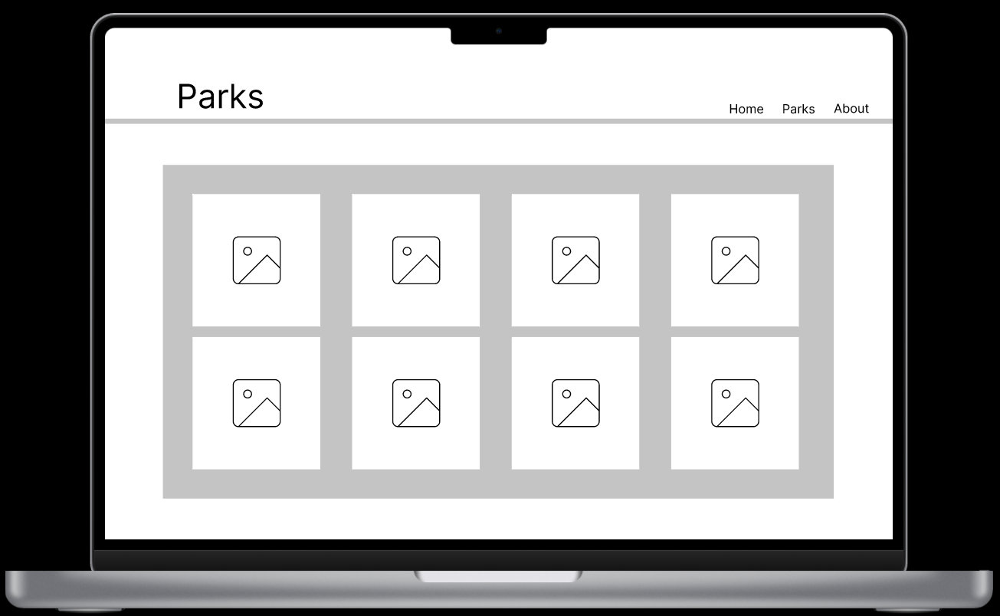

# Rollercoasters of the US
## Group project 
### Brynner, Michelle, Ryan & Tim

## Summary
For our "Theme Park-Themed" full-stack app, we plan to build a database of major amusement parks in the US, as well as the most popular rollercoasters these parks have to offer. The database will be searchable, and have a variety of interative sorting methods to see a few different "Top Ten" lists of the best rollercoasters out there. 

## Back End
For our database, we plan to build one collection for Parks, and a separate collection for Rollercoasters, which we will link together via a "one-to-many" data structure. 

### Database / Collections
**Parks (collection)** will contain basic information like name, location, address, web url, and a list of their top 2 or 3 rollercoasters.

**Rides (collection)** will contain the name of each rollercoaster, as well as some of the most highly-advertised stats about each, including height, length, and top speed. Each Ride in this collection will be object-associated with the Park where it is found. 

### Controllers
We will also need to create Controller methods to access all of the entries from each collection, as well as to create, update and delete entries from the database.  

## Front End
We plan to lay out our React app with a simple landing page, a header bar with a few navigation buttons ("Home", "Parks", "About", etc.), and a search bar to search the Parks collection by name. Using React Router, we will also create Components to display more details about each Park and each rollercoaster. It could also include an "Explore" section that will display a random selection of parks for the user to explore. 

The **Search** Component will be included on the landing page, and will allow the user to search the Parks collection by the name of the park they're looking for, and display all entries that match their search query.

The **Parks** Component will display all of the theme parks in the collection. We will use React Router to allow the user to click each park and retreive information about that park, inlcuding name, location, description, website, etc. It will also list the park's most popular rollercoasters.

The **Rides** Component will display all rollercoasters in the database; clicking into a ride will retreive its data, including description, specs and a photo. The "Rides" page can also include direct links to the "Top 10 Highest", (etc.) Components.

The individual "park" and "ride" Components will display more detailed information taken from their respective database collections, using Router :id params to display the selected page.

Any "Top Ten" lists that we are able to create will be done effectively by calling all of the data and sorting it by a given key:value pair, (e.g. "height"), and then returning the first 10 Objects in the list. 

## Work Plan

We have broken our group into Team Front End (Ryan, Brynner) and Team Back End (Michelle, Tim). We will review and make use of the lessons we've learned about React and Mongo/Express, and then use past lessons as basic skeletons on which to build our project. Michelle is currently our GitHub Captain.

### Trello board:
https://trello.com/b/vgt1ojIx/roller-coaster-project

## Resources

### GitHub Repo:
https://github.com/myang292/SEIR222_Rollercoaster
### Figma wireframes
https://www.figma.com/file/jZ2z0BabyDLsOKqbWe550J/Untitled?node-id=0%3A1
